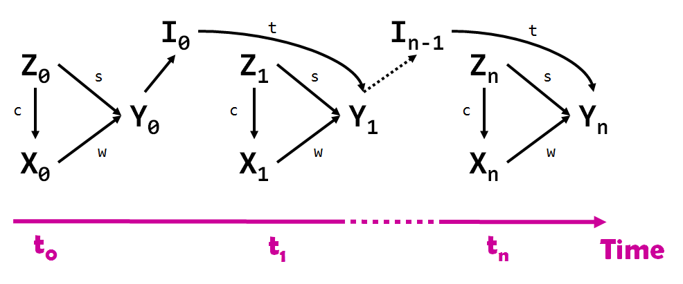
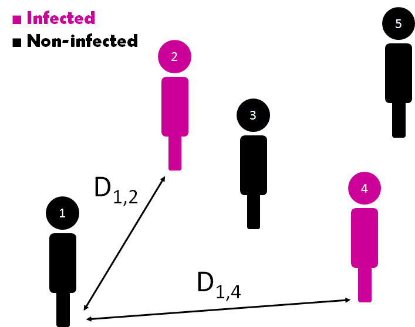
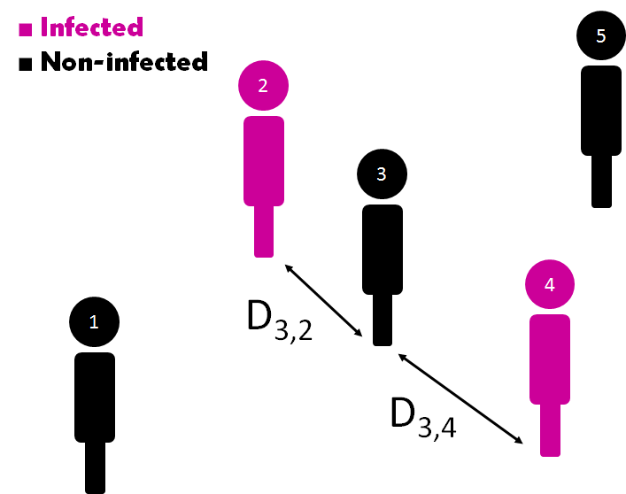

# ABM_CausalInf and HPV
## 1. General description of the project
This repository will contain the code for generating (`Java`) and analysing (`R programming language`) a simple multi-Agent Based Model (mABM) of patients in a 2D continuous space. The idea is to simulate the contagion of a disease thought a population: human papilloma virus (HPV).

__Note__: This `.java` project could be run by creating a project using your favourite Integrated Development Environment (IDE) and cloning this repository. This simulation relies on the `Mason` java library and its dependencies. Please ensure that these are added as libraries to the project. The link to `Mason` dependencies is the following: https://cs.gmu.edu/~eclab/projects/mason/

### 1.1 Learning objectives of the intern
 - Learn Java programming while creating an ABM
 - Learn R programming while using the G-methods to analyse the results generated from the ABM
 
### 1.2 Project outcomes
 - Integrate of ABMs and Causal Inference
 - Integrate the spatial dimension with time-dependent confounders
 - Violate the Stable Unit Treatment Value Assumption (SUTVA) of causal inference

Why this integration? ABM are used to simulate individuals and the consequences of interactions and their behaviours. Nevertheless, the accuracy of this simulations is highly reliant on capturing the complexity of the relationships between individuals over spactio-temporal scenarios. Current methodologies lack the sophistication to capture causal relationships. By integrating ABM and causal inference;:
 - more complex and accurate simulations could be implemented
 - better understanding about how populations react to interventions
 
Why the violation of SUTVA? SUTVA states that:
  - Individuals do not interfere with each other (this is the strength of AMBs)
  - Treatment assignment of one unit does not affect outcome of another unit
  
In this example, the effectiveness of vaccination in HPV prevention will depend on how many people were vaccinated and how they interact. Individuals, in this case agents, will interfere with each other and this will be reflected with the Euclidean distance between them. Also, the vaccination of one unit or agent will reduce the transmission effect.

__Note__: This simulation is not going to be 100% realistic, it will be an example of how to integrate causal inference and ABMs.

## 2 Human Papilloma Virus (HPV)
### 2.1 HPV description
__HPV__ is the most common sexually transmitted infection. Most HPV infections cause no symptoms and resolve spontaneously. Nevertheless, it increases the risk of cancer of the cervix, vulva, vagina, penis, anus, mouth, or throat.

__Risk factors__ include sexual intercourse,multiple partners, smoking, and poor immune system. HPV is typically transmitted by sustained direct skin-to-skin contact.

### 2.2 HPV transmission
Once the HPV infects a person, an active infection occurs and the virus can be transmitted. Several months to years may elapse before the visible symptoms can be clinically detected in the form of intraepithelial lesions, making it difficult to know which partner was the source of infection.

### 2.3 HPV prevention
HPV vaccines can prevent the most common types of infection. In women, HPV infection can cause cervix cancer and women are more likely to get vaccinated with Gardasil, preventing around 90% of infections. Nevertheless, vaccination is less common in men (here it comes our confounder).

## 3. Directed Acyclic Graph (DAG) and causal description

In this example, there will be a simple confounder `Z`, sex, that conditions both the outcome `Y`, infection, and the vaccine status `X`. Vaccine status `X` and outcome `Y` are time-dependent variables whereas `Z` is going to be time-invariant.

### 3.1 Variables

Variable | Meaning | Type
--- | --- | ---
`Z`| Sex of the agent | Boolean
`X` | Has received vaccination? | Boolean
`Y`| Is infected? | Boolean
`I`| Infected cumulative distance | Double
`c`| Causal weight of `Z` in `Y` or confounding | Double
`s`| Causal weight of `Z` in `X` | Double
`w`| Causal weight of `X` in `Y` | Double
`t`| Causal weight of `I` in `Y` or transmission power or weight | Double

### 3.2 Causal Diagram

The DAG will look like this:

### 3.3 Infected Cumulative Distance

What does the infected cumulative distance (`I`) mean? 

The Infected Cumulative Distance `I` was defined as the distance `D` per agent `i` at each time `t` with regards to each other (`n-1`) agent `j` without considering itself and depending on the outcome `Y` of each agent `j`.

Let's see a hypothetical example for `agent_1` for time zero (`time = 0`)

and in this concrete example, considering `Y` as either `1` or `0`, for `agent_1` in time zero:

What about the `agent_3` at time or step one (`time = 1`)?

The infected cumulative distance for the `agent_3` at time or step `1` will be defined as:

### 3.4 Probability of getting the vaccine
The probability of getting the vaccine is just going to depend on the sex (`Z`), a time-independent variable:

and `P(X,Z)` is going to depend on the confounding weight and the baseline (can I say prior?) probability of getting the vaccine (__Note__: the probability of getting the vaccine, the vaccine, does not depend on having the outcome. It is a prevention that in this hypothetical scenario, for economical, social reasons is not used in the whole population. Nonetheless, the probability of getting the vaccine can be manipulated):

### 3.5 Probability of getting infected
Based on the DAG, the probability of getting infected `Y` at time `n` will depend on the agent's sex (`Z`), the vaccination status (`X`), and the infected cumulative distance (`I`):

The probability of getting infected `Y` was defined as:

The probability of getting infected `Y` depended on:
 - The sex (`Z`) and its causal weight on the outcome (`s`)
 - The vaccine (`X`) and its causal weight in the outcome (`w`)
 - The baseline probability of getting infected that will be randomly defined `P_{baseline}(Y)`
 - The transmission power or weight (`t`)
 - The number of infected patients (`n`) at the inmediate prior time (`time n-1`), and
 - The infected cumulative distance (`I`) at the inmmediate prior time (`time n-1`) that converts this simulation in an ABM and not a mere Marginal Structural Model (MSM).

Why this formula?

__First addend of the equation__ (`p1`): The probability of getting infected will depend on the sex, vaccine, and its causal weights. The vaccine causal weight (`w`) will control how effective the vaccine is: if `w` is big enough, the above result will be minor than zero and therefore the vaccination will completely prevent the infection.

__Second addend of the equation__(`p2`): The more infected agents in the simulation, the more likely an agent will be infected. The cumulative distance will account for the interactions between agents: (i) in the extreme case where all infected patients are at the exact same location of the remaining uninfected agent, `I` will have a value of 0 and the transmission effect will be maximum; (ii) in the oposite extreme case where all infected patients are infinitively distant from the remaining uninfected patient, `I` will have an infinite value and the transmission effect will be minimum.

## 4. ABM and its variables
In this mABM, the agents will be created at the same location but there will be some forces that will control their movement in the 2D space:
 - Friend force
 - Central force
 - Random force

At every step of the simulation, each agent will have at least one friend. Agents will tend to socialise, interact with their friends.

The following variables were defined for the ABM:

Variable | Meaning | Type
--- | --- | ---
`P_infected`| Baseline probability of infection | Double
`P_vaccine` | Baseline probability of vaccination | Double
`max_force`| Max value of friend forces | Double
`central_force`| Joining force to keep agents in the center of the 2D space | Double
`randomness`| Weight that control the force that makes the agents wander randomly | Double
`promiscuity`| Probability of changing Friends and Strangers | Double
