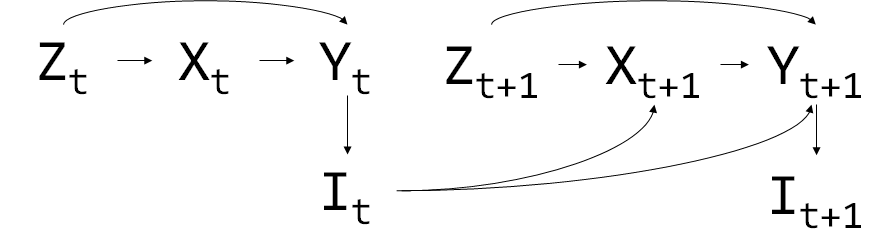
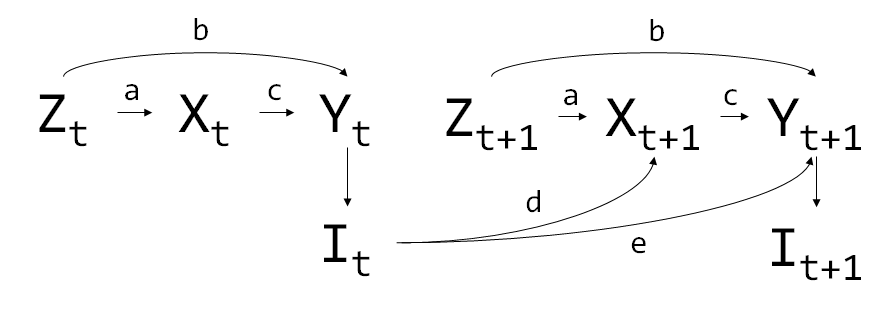
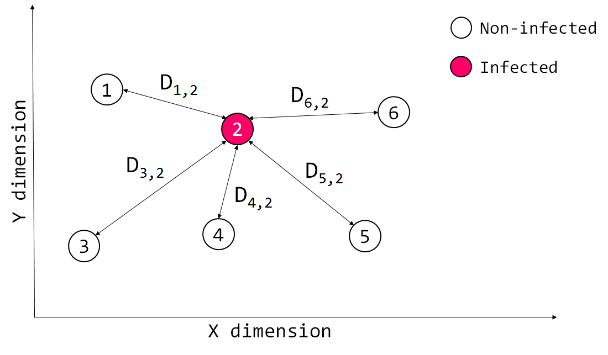
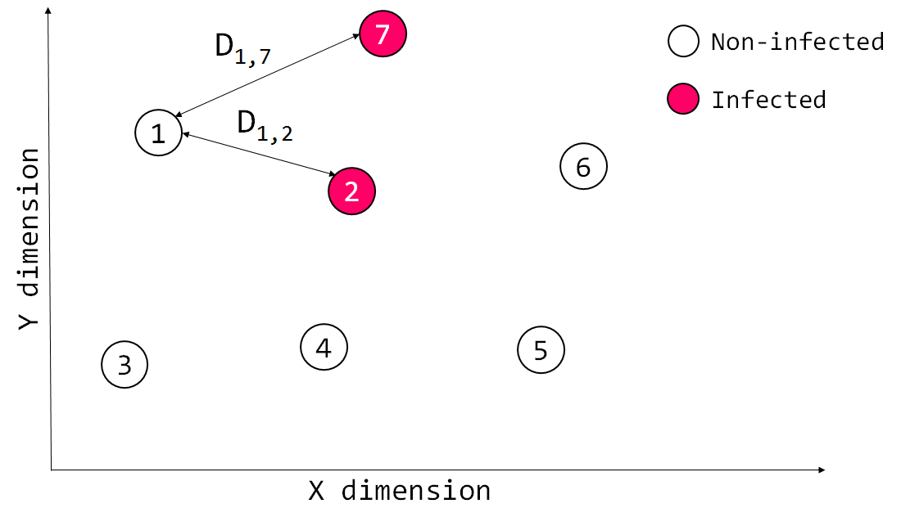
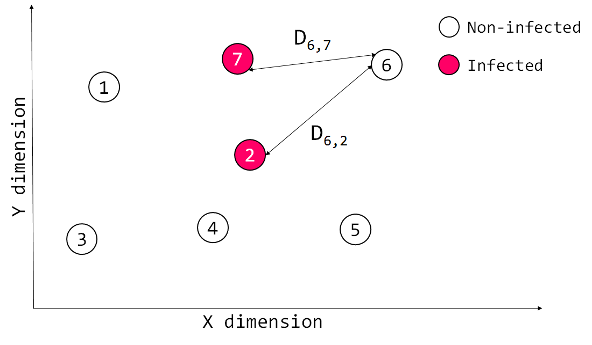
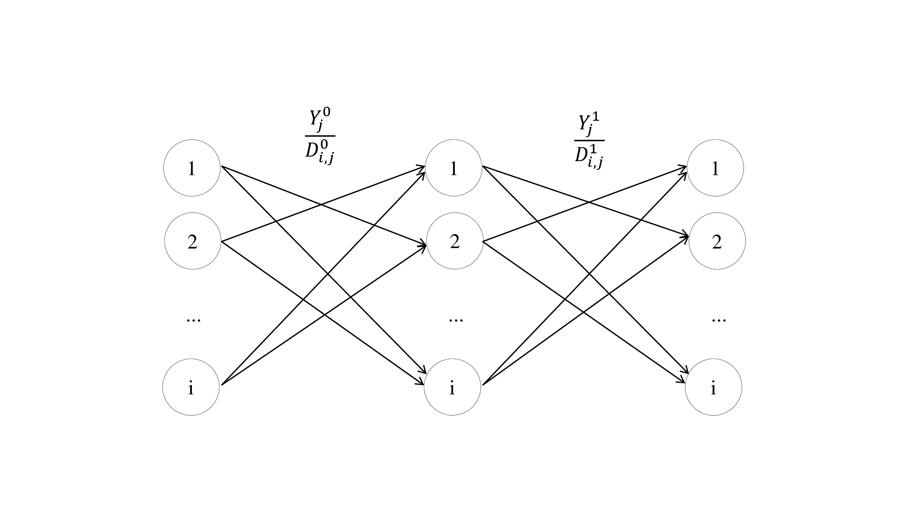

# ABM_CausalInf and HPV
_______________________

## 1. General description of the project
This repository will contain the code for generating (`Java`) and analysing (`R programming language`) a simple multi-Agent Based Model (mABM) of patients in a 2D continuous space. The idea is to simulate (i) causal diagrams for interference, (ii) ABMs, and the contagion of a disease thought a population: human papilloma virus (HPV).

__Note__: This `.java` project could be run by creating a project using your favourite Integrated Development Environment (IDE) and cloning this repository. This simulation relies on the `Mason` java library and its dependencies: already included in the repository. If there are any problems, the link to `Mason` dependencies is the following: https://cs.gmu.edu/~eclab/projects/mason/

### 1.1 Learning objectives of the intern
 - Learn Java programming while creating an ABM
 - Learn R programming while using the G-methods to analyse the results generated from the ABM
 
### 1.2 Project outcomes
 - Integrate of ABMs and Causal Inference
 - Integrate the spatial dimension with time-dependent confounders
 - Violate the Stable Unit Treatment Value Assumption (SUTVA) of causal inference

Why this integration? ABM are used to simulate individuals and the consequences of interactions and their behaviours. Nevertheless, the accuracy of this simulations is highly reliant on capturing the complexity of the relationships between individuals over spatio-temporal scenarios. Current methodologies lack the sophistication to capture causal relationships. By integrating ABM and causal inference:
 - more complex and accurate simulations could be implemented
 - better understanding about how populations react to interventions
 
Why the violation of SUTVA? SUTVA states that:
  - Individuals do not interfere with each other (this is the strength of AMBs)
  - Treatment assignment of one unit does not affect outcome of another unit

### 1.3 Interference introduction
This piece of research will be based on:

- E. L. Ogburn and T. J. VanDerWeele:
  "Causal Diagrams for Interference" Statistical Science, Vol. 29, No. 4, Special Issues on Semiparametrics and Causal Inference (November 2014), pp. 559-578 at https://www.jstor.org/stable/43288499.
  Accessed: 02-06-2018

Traditionally, causal inference relied on the assumption of no interference: one individual's exposure may affect another individual's outcome. SUTVA is violated when the outcome is an infectious disease and treating one individual may exert a protective effect on others in a given population.
  
In this example, the effectiveness of vaccination in HPV prevention will depend on how many people were vaccinated and how they interact. Individuals, in this case agents, will interfere with each other. Also, the vaccination of one individual, in our case agent, will reduce the contagion effect. This description will be formally expressed in mathematical terms and DAGs in the following sections.

__Note!__: This simulation is not going to be 100% realistic, it will be an example of how to integrate causal inference and ABMs.

## 2 Human Papilloma Virus (HPV)
### 2.1 HPV description
__HPV__ is the most common sexually transmitted infection. Most HPV infections cause no symptoms and resolve spontaneously. Nevertheless, it increases the risk of cancer of the cervix, vulva, vagina, penis, anus, mouth, or throat.

__Risk factors__ include sexual intercourse, multiple partners, smoking, and poor immune system. HPV is typically transmitted by sustained direct skin-to-skin contact.

### 2.2 HPV transmission
Once the HPV infects a person, an active infection occurs and the virus can be transmitted. Several months to years may elapse before the visible symptoms can be clinically detected in the form of intraepithelial lesions, making it difficult to know which partner was the source of infection.

### 2.3 HPV prevention
HPV vaccines can prevent the most common types of infection. In women, HPV infection can cause cervix cancer and women are more likely to get vaccinated with Gardasil, preventing around 90% of infections. Nevertheless, vaccination is less common in men (here it comes our simple confounder: sex).
Also, 

## 3. Directed Acyclic Graph (DAG) and causal description of the project
### 3.1 DAG definition and properties
Causal diagrams, or causal directed acyclic graphs (DAGs) consist of nodes, representing the variables in a study, and arrows, representing direct causal effects. A path on a DAG is any unbroken, non-repeating sequence of arrows connecting one variable to another.
 - DAGs are directed because there is a unique path that follows arrows from tail to head.
 - DAGs are acyclic because they do not contemplate the existance of loops of arrows that converge in the same variable the first arrow emanated from.
Reference for more information about DAGs: [include]

### 3.2 Causal description
Following the description from Ogburn and VanderWeele (2014), it is often reasonable to make a "partial interference" assumption where interference can only occur within subgroups or "blocks" of agents that are separated in time and/or space. The conterfactual notation for interference will follow Hudgens and Halloran (2008): suppose than `n` individual fall into `N` blocks, indexed by `k` with `m = n/N` individuals in each block. In this example, we will assume `N = 1` so that interference may occur between any two agens in the population: a full interference with no blocks.

Furthermore, we wish to estimate the average causal effect of a vaccine `A` on an outcome `Y`, infection, from simulation data on `n` individuals for whom we have also measured a vector of confounders `C`, the sex of the agents. For simplicity , we assume that both `A` and `Y` are binary.

Let `A ≡ (A_1,...,A_n)` be the vector of vaccination assignment under the assumption of single version of treatment for agents at a given time `t`. Let `Y ≡ (Y_1,...,Y_n)` and `C ≡ (C_1,...,C_n)` be the vector of autcomes and array of covariates, respectively, for `n` agents at given time `t`. Define `Yi(a),a = 0,1` is defined as the counterfactual outcome we would have observed if, contrary to the fact, agent `i` had received treatment `a`, this is, if we would have observed for agent `i` under an intervention that set `A` to `a`.

We define the consistency assumption based on Ogburn and VanderWeele (2014) as:

(1). 

when

The exchangeability assumption, also known as the "no unmeasured confounding assumption" to account for the causal effects under interference: we assume that we have measured a set of prevaccination covariates `C` for each agent such that:

(2). 

and the positivity assumption:

(3). 

for all `a` in support of `A` and all `c` in support of `C`

The overall effect (OE) of intervention `a` compared to intervention `a'` on subject `i` is defined as  where `i` indicates that the expectations do not average over individuals and  averages over the empirical mean of the conterfactual outcomes at time `t`.

The variable that captures the interaction among patients `I` will also be a confounder, conditioning both vaccination `X` and the outcome `Y`.

### 3.3 Variables

Variable | Meaning | Type
--- | --- | ---
`C`| Sex of the agent | Boolean
`A` | Has received vaccination? | Boolean
`Y`| Is infected? | Boolean
`I`| Interference of contagion, or Inverse cumulative distance of infected | Double
`a`| Causal weight of `Z` in `X` | Double
`b`| Causal weight of `Z` in `Y` | Double
`c`| Causal weight of `X` in `Y` | Double
`d`| Causal weight of `I` in `Y` or contagion weight | Double

### 3.2 Causal DAG and causal net

Being `t` the time, the DAG will look like this:

Based on the definitions of the variables in the above table, the causal DAG with the weights will look like this:

### 3.3 Infected Cumulative Distance

What does the infected cumulative distance (`I`) mean? Agents will be interacting with each other and the probability of interaction will be a simple function of their proximity:

The infected cumulative distance `I` for each agent `i` at each time point `t` will be defined as:

[Equation 1]

The Infected Cumulative Distance `I` was defined as the distance `D` per agent `i` at each time `t` with regards to each other (`n-1`) agent `j` without considering itself and depending on the outcome `Y` of each agent `j`.

Let's see a hypothetical example for `agent_1` for time zero (`time = 0`)

and in this concrete example, considering `Y` as either `1` or `0`, for `agent_1` in time zero:

What about the `agent_6` at time one (`time = 1`)?

The infected cumulative distance for the `agent_6` at time `1` will be defined as:

We can also think about the Infected Cumulative Distance `I` in a similar way to a forward propagation of a neural net where the value that reaches each node of the next layer is `I^t_j` per agent `j` and time `t` as defined in __[Equation 1]__.

And the collection of all Infected Cumulative Distances `I` could be represented as a variable as we did in the DAG:

### 3.4 Probability of getting the vaccine
The probability of getting the vaccine is just going to depend on the sex (`Z`), a time-independent variable:

and `P(X,Z)` is going to depend on the confounding weight and the baseline (can I say prior?) probability of getting the vaccine (__Note__: the probability of getting the vaccine, the vaccine, does not depend on having the outcome. It is a prevention that in this hypothetical scenario, for economical, social reasons is not used in the whole population. Nonetheless, the probability of getting the vaccine can be manipulated):

### 3.5 Probability of getting infected
Based on the DAG, the probability of getting infected `Y` at time `n` will depend on the agent's sex (`Z`), the vaccination status (`X`), and the infected cumulative distance (`I`):

The probability of getting infected `Y` was defined as:

The probability of getting infected `Y` depended on:
 - The sex (`Z`) and its causal weight on the outcome (`s`)
 - The vaccine (`X`) and its causal weight in the outcome (`w`)
 - The baseline probability of getting infected that will be randomly defined `P_{baseline}(Y)`
 - The transmission power or weight (`t`)
 - The number of infected patients (`n`) at the inmediate prior time (`time n-1`), and
 - The infected cumulative distance (`I`) at the inmmediate prior time (`time n-1`) that converts this simulation in an ABM and not a mere Marginal Structural Model (MSM).

Why this formula?

__First addend of the equation__ (`p1`): The probability of getting infected will depend on the sex, vaccine, and its causal weights. The vaccine causal weight (`w`) will control how effective the vaccine is: if `w` is big enough, the above result will be minor than zero and therefore the vaccination will completely prevent the infection.

__Second addend of the equation__(`p2`): The more infected agents in the simulation, the more likely an agent will be infected. The cumulative distance will account for the interactions between agents: (i) in the extreme case where all infected patients are at the exact same location of the remaining uninfected agent, `I` will have a value of 0 and the transmission effect will be maximum; (ii) in the oposite extreme case where all infected patients are infinitively distant from the remaining uninfected patient, `I` will have an infinite value and the transmission effect will be minimum.

## 4. ABM and its variables
In this mABM, the agents will be created at the same location but there will be some forces that will control their movement in the 2D space:
 - Friend force
 - Central force
 - Random force

At every step of the simulation, each agent will have at least one friend. Agents will tend to socialise, interact with their friends.

The following variables were defined for the ABM:

Variable | Meaning | Type
--- | --- | ---
`P_infected`| Baseline probability of infection | Double
`P_vaccine` | Baseline probability of vaccination | Double
`max_force`| Max value of friend forces | Double
`central_force`| Joining force to keep agents in the center of the 2D space | Double
`randomness`| Weight that control the force that makes the agents wander randomly | Double
`promiscuity`| Probability of changing Friends and Strangers | Double

### References
1. E. L. Ogburn and T. J. VanDerWeele:
   "Causal Diagrams for Interference" Statistical Science, Vol. 29, No. 4, Special Issues on Semiparametrics and Causal Inference (November 2014), pp. 559-578 at https://www.jstor.org/stable/43288499.
  Accessed: 02-06-2018
2. M. G. Hudgens and M. E. Halloran:
   "Towards Causal Inference with Interference" Journal of the American Statistical Association. 2008, June; 103 (482): pp. 832-842 at https://amstat.tandfonline.com/doi/abs/10.1198/016214508000000292#.WxaoRRzTWGA
   Accessed: 02-06-2018
